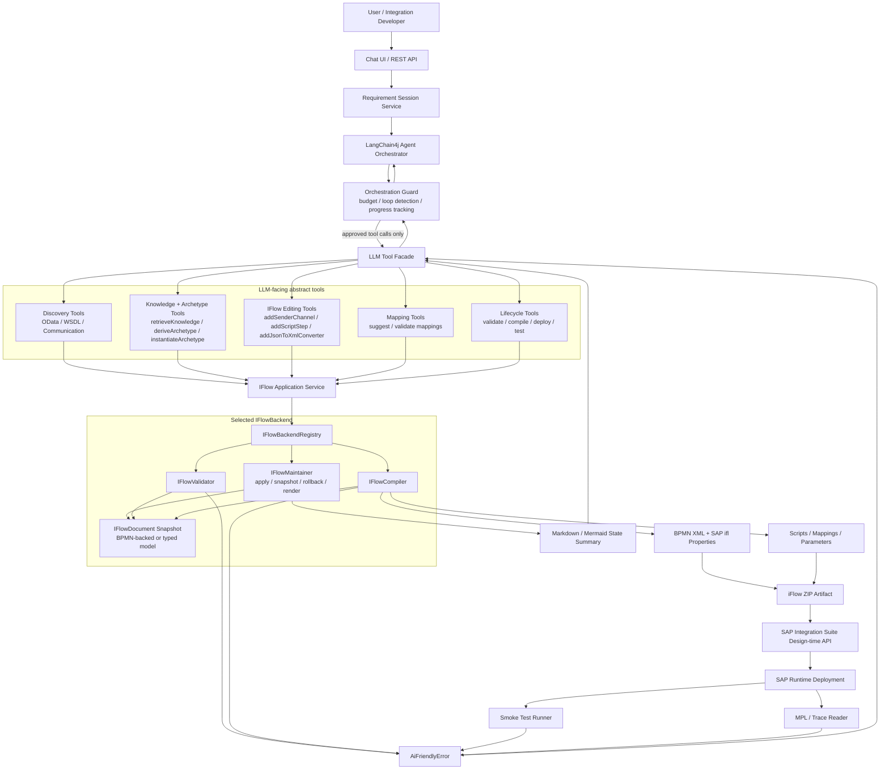
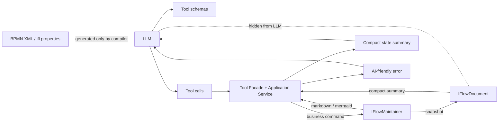
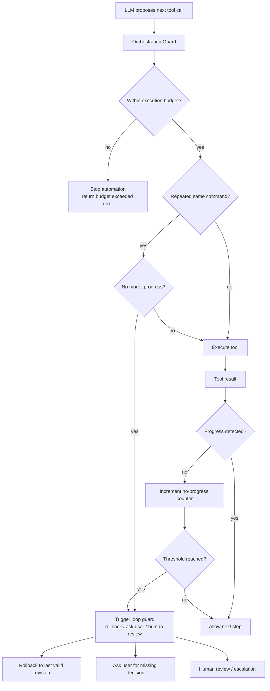
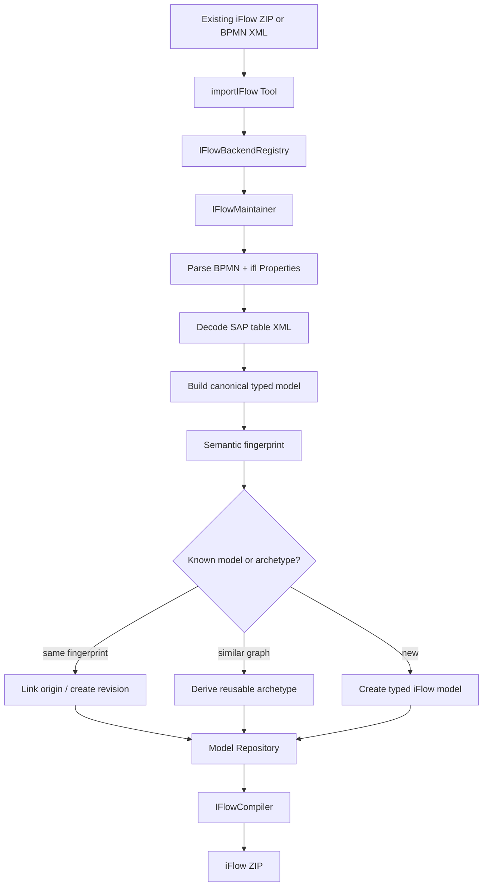

# 架构设计

## 1. 架构原则

- 大模型负责规划、查询、决策和调用工具。
- Java 后端负责 tools、内部模型状态、校验、编译、部署、测试和审计。
- 大模型不直接读取或提交完整内部模型；类型化 iFlow 内部模型是 tool 层之后的内部状态。
- iFlow 的内部模型是 BPMN-backed typed graph data structure：它不是自定义语言，也不是原始 BPMN XML；JSON 只是持久化和 API 传输格式之一。
- BPMN XML、SAP `ifl` 扩展属性、资源文件和 iFlow ZIP 只能由确定性 compiler 从内部模型生成。
- 所有外部系统访问通过 Tool / Client 封装。
- 每次需求执行过程必须可追踪、可回放、可评估。

## 2. 总体架构



### 2.1 LLM / Tool / Model 边界



### 2.2 Auto-fix loop guard



### 2.3 Import / reuse / compile flow



### 2.4 Extensibility map

```mermaid
flowchart TD
    App[IFlowApplicationService] --> ToolSPI[Tool SPI]
    App --> BackendSPI[IFlowBackend SPI]
    App --> GuardSPI[Guardrail SPI]
    App --> KnowledgeSPI[Knowledge SPI]
    App --> ClientSPI[External Client SPI]
    App --> PersistenceSPI[Persistence SPI]

    ToolSPI --> ToolImpl1[Concrete LLM Tools]
    ToolSPI --> ToolImpl2[Future Domain-specific Tools]

    BackendSPI --> Backend1[BpmnIFlowBackend]
    BackendSPI --> Backend2[TypedModelIFlowBackend]
    BackendSPI --> Backend3[JsonIFlowBackend]

    GuardSPI --> Guard1[BudgetPolicy]
    GuardSPI --> Guard2[LoopDetector]
    GuardSPI --> Guard3[ProgressTracker]
    GuardSPI --> Guard4[CircuitBreaker]
    GuardSPI --> Guard5[HumanHandoffPolicy]

    KnowledgeSPI --> K1[Vector Knowledge Store]
    KnowledgeSPI --> K2[Archetype Store]
    KnowledgeSPI --> K3[Rule Store]

    ClientSPI --> C1[SAP Design-time Client]
    ClientSPI --> C2[SAP Runtime Client]
    ClientSPI --> C3[OData Metadata Client]
    ClientSPI --> C4[MPL Trace Client]

    PersistenceSPI --> P1[In-memory Repository]
    PersistenceSPI --> P2[PostgreSQL Repository]
    PersistenceSPI --> P3[Object Storage Artifact Store]
```



每个扩展点必须满足：

- 通过 interface / SPI 暴露能力。
- 默认实现可替换。
- 输入输出使用稳定 DTO / command / result。
- 低层异常必须转换为 AI-friendly error 或 diagnostics。
- 实现之间不能互相依赖具体类，只依赖抽象契约。

## 3. 分层设计

### 3.1 API 层

负责对外暴露 REST API：

- `/api/requirements`
- `/api/graphs`（MVP 存储骨架；后续演进为 `/api/iflows`）
- `/api/discovery`
- `/api/lifecycle`

API 层只做参数校验和服务编排，不写业务状态逻辑。

### 3.2 Session / Trace 层

保存每个需求的生命周期：

- RequirementSession
- ConversationMessage
- ToolCallTrace
- GraphSnapshot
- Artifact
- Deployment
- TestRun

当前 MVP 使用内存 repository；后续替换为 PostgreSQL。

### 3.3 Agent Orchestration 层

LangChain4j Agent 使用系统提示词、历史消息、retrieved knowledge 和工具列表进行多轮决策。

Agent 的硬规则：

1. 不直接生成 BPMN XML。
2. 使用 OData 前必须查询 metadata。
3. 不直接读取、构造或提交完整内部模型。
4. 只能通过 tools 获取 compact iFlow state summary 和执行状态变更。
5. 部署前必须调用 validation tool。
6. 失败后必须读取 AI-friendly tool error、MPL/trace 摘要，再选择下一步 tool。
7. 不得把 password、token、client secret 作为 tool 参数传入。
8. 不能绕过 Orchestration Guard 的预算、loop detection 和 circuit breaker。

Agent 不负责：

- 拼接内部模型 JSON。
- 维护 BPMN ID 或 SAP `ifl:property`。
- 解释 Java stack trace。
- 从低层 XML diff 判断业务语义。

### 3.4 Tool 层

工具分为 read-only discovery tool 和 state mutation tool。

Tool 层是 LLM 与内部模型的唯一边界：

- read-only tool 可以返回知识、metadata、compact iFlow summary、semantic diff、validation report。
- state mutation tool 接收业务语义命令，并在后端事务中修改内部模型。
- 每次 state mutation 必须记录 tool input、normalized command、model revision、validation outcome。
- Tool 不应把完整内部模型当作 prompt context 返回给 LLM；需要返回可读摘要和下一步可执行 action。

工程化规则：

- 每个 state mutation tool 最终都会落到 `IFlowMaintainer.apply(command)`。
- `IFlowMaintainer` 必须在一次事务内完成 mutation、revision 创建和最小校验。
- `IFlowMaintainer` 必须支持 `renderMarkdown()` 和 `renderMermaid()`，用于给 LLM 返回当前流程上下文。
- `IFlowMaintainer` 必须支持 `rollbackTo(revision)`，用于自动修复失败或用户要求回退。
- LLM-facing tool 不接受任意模型补丁；节点、边、channel、adapter、step 类型必须来自枚举。

### 3.4.1 Orchestration Guard

Orchestration Guard 位于 LLM Orchestrator 与 Tool Facade 之间，负责阻止无效循环和危险调用：

- Execution budget: 限制每轮 tool calls、mutation calls、compile attempts、deploy attempts、auto-fix iterations。
- Loop detector: 检测重复 tool call、重复 error、重复 no-op mutation。
- Progress tracker: 判断 revision、validation issues、compile phase、deploy state、test result 是否有实质进展。
- Idempotency checker: 基于 command fingerprint 识别重复 mutation。
- Circuit breaker: SAP API、metadata、deploy、MPL 读取连续失败时停止同类调用。
- Escalation policy: 触发 rollback、ask user、human review 或暂停自动修复。

Guard 的输出也是 AI-friendly error，不直接返回底层异常。

Read-only tools：

- 查询 OData metadata。
- 查询 Communication Arrangement。
- 查询 credential alias 是否存在。
- 查询知识库、样本库、skills、rules。
- 查询 iFlow archetype、模板实例和 semantic diff 历史。
- 查询部署和 MPL 日志。

State mutation tools：

- createIFlow / createGraph（MVP 兼容）。
- addParticipant。
- addSenderChannel。
- addReceiverChannel。
- addScriptStep。
- addContentModifierStep。
- addJsonToXmlConverter。
- addXmlToJsonConverter。
- addProcessCallStep。
- addRequestReplyStep。
- connectSteps。
- setAdapterPolicy。
- setStepConfig。
- addDataMappings。
- deriveArchetype。
- instantiateArchetype。
- compareIFlows。
- compileIflow。
- deployIflow。

Backend-only abstractions：

- `IFlowBackendRegistry`: 根据 workspace、artifact 来源、维护策略选择 backend。
- `IFlowBackend`: 聚合 maintainer、validator、compiler。
- `IFlowMaintainer`: 维护某种内部表示，并产出 `IFlowDocument` snapshot。
- `IFlowCompiler`: 编译某种 `IFlowDocument` 为 iFlow ZIP。

可插拔 backend：

- `BpmnIFlowBackend`: `BpmnIFlowMaintainer` 直接维护 BPMN model，适合 round-trip 现有 iFlow。
- `TypedModelIFlowBackend`: `TypedModelIFlowMaintainer` 维护类型化流程图，适合新建和抽象编辑。
- `JsonIFlowBackend`: `JsonIFlowMaintainer` 维护 JSON graph，适合未来轻量/兼容场景。

### 3.5 AI-friendly Error Contract

所有 tool、validator、compiler、deploy/test wrapper 对大模型返回错误时必须使用结构化错误对象：

```json
{
  "status": "failed",
  "errorCode": "MISSING_REQUIRED_PARAMETER",
  "category": "validation",
  "severity": "error",
  "message": "XI receiver SOAP_Receiver_MM is missing required QualityOfService.",
  "affectedObject": {
    "kind": "channel",
    "semanticKey": "channel.receiver/SOAP_Receiver_MM"
  },
  "reason": "The receiver adapter references receiver.qualityOfService but the parameter has no value or default.",
  "suggestedFixes": [
    {
      "action": "setAdapterPolicy",
      "arguments": {
        "channelName": "SOAP_Receiver_MM",
        "qualityOfService": "ExactlyOnce"
      }
    }
  ],
  "retryable": true
}
```

错误对象应突出：

- 什么失败了。
- 影响哪个语义对象。
- 为什么失败。
- 模型下一步可以调用哪个 tool。
- 是否需要用户输入。
- 哪些低层细节被隐藏在 diagnostics / trace 中。

### 3.6 类型化 iFlow 内部模型层

类型化 iFlow 内部模型是 iFlow 的后端状态表示。它本质上是一个可校验、可版本化、可投影到 BPMN 的流程图数据结构。当前代码中的 `IntegrationGraph` 可作为 MVP 存储骨架，后续应逐步演进为 process-aware 的模型：

```text
IFlow
  - metadata
  - namespaces
  - participants
  - channels
  - processes
  - resources
  - parameters
  - policies
  - layoutHints
  - vendorExtensions
  - version
```

它应支持：

- JSON/YAML/数据库记录序列化。
- schema validation。
- diff。
- snapshot。
- rollback。
- markdown / mermaid rendering for LLM state summary。
- compiler input。
- semantic diff。
- archetype extraction and instantiation。
- canonical import and semantic fingerprinting。

### 3.7 Compiler 层

第一阶段采用 template-based compiler：

```text
Template ZIP
  -> load .iflw XML
  -> apply typed model changes
  -> inject scripts / mappings / parameters
  -> update manifest
  -> package ZIP
```

这样比完全从零生成所有 SAP BPMN XML 稳定。

### 3.8 SAP Client 层

封装 SAP 访问能力：

- S/4HANA OData metadata client。
- S/4HANA OData sample query client。
- Integration Suite design-time artifact client。
- Integration Suite deploy client。
- Integration Suite MPL / trace client。

所有 client 通过接口定义，便于 mock 和测试。

## 4. 推荐包结构

核心类关系见 [核心类图](06-class-diagram.md)。

```text
com.example.integrationsuiteagent
  agent/              Agent orchestration
  api/                REST controllers and DTOs
  config/             Spring configuration
  domain/graph/       MVP graph model, evolving toward typed iFlow model
  domain/session/     Requirement session and trace domain model
  graph/              Graph mutation and validation services
  lifecycle/          Compile/deploy/test lifecycle services
  odata/              OData metadata DTOs and clients
  repository/         Persistence abstraction
  session/            Session services
  tool/               LangChain4j tools
```

## 5. 数据流：创建 PO 查询 iFlow

```text
1. User sends requirement.
2. Session service stores message.
3. Agent retrieves PO query skill and rules.
4. Agent calls getODataMetadata(S4_DEV, API_PURCHASEORDER_2).
5. Agent calls getInboundServiceUrl(S4_DEV, SAP_COM_0053, API_PURCHASEORDER_2).
6. Agent calls createIFlow / createGraph.
7. Agent calls semantic editing tools such as addSenderChannel / addScriptStep / addJsonToXmlConverter / setAdapterPolicy.
8. Tool layer updates internal model revision and returns compact state summary.
9. Agent calls validateGraph / validateIFlowModel.
10. Agent calls compileIflow.
11. Agent calls uploadAndDeployIflow.
12. Agent calls runSmokeTest.
13. If failed, Agent reads AI-friendly error / MPL summary, calls tools to edit iFlow state, recompiles, redeploys.
```

## 6. 部署架构建议

MVP：

```text
Spring Boot app + in-memory repositories
```

生产化：

```text
Spring Boot app
PostgreSQL
pgvector / Milvus
Object Storage
Redis optional
SAP Integration Suite tenant
S/4HANA systems
LLM provider gateway
```

## 7. 安全设计

- 内部模型只保存 credential alias。
- Secret 存在 SAP Integration Suite security material 或企业 secret manager。
- ToolCallTrace 对敏感字段做脱敏。
- 生产部署必须可配置人工确认。
- 按 tenant、system、package、artifact 做权限控制。

## 8. 可观测性

需要记录：

- 每次用户消息。
- 每次模型回复。
- 每次工具调用输入输出。
- 内部模型每次版本变化。
- 编译产物 checksum。
- 部署 ID。
- MPL ID。
- smoke test 输入输出。
- 自动修复次数和修复原因。
