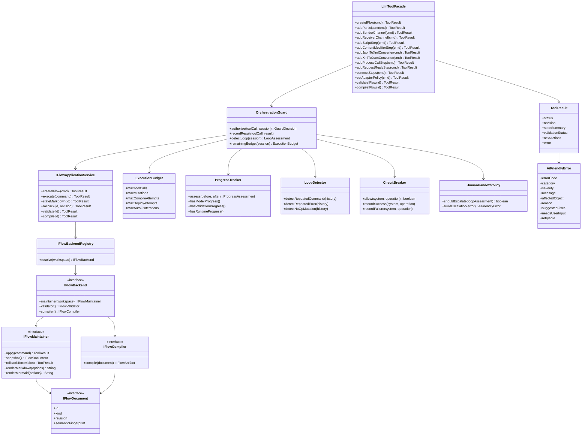
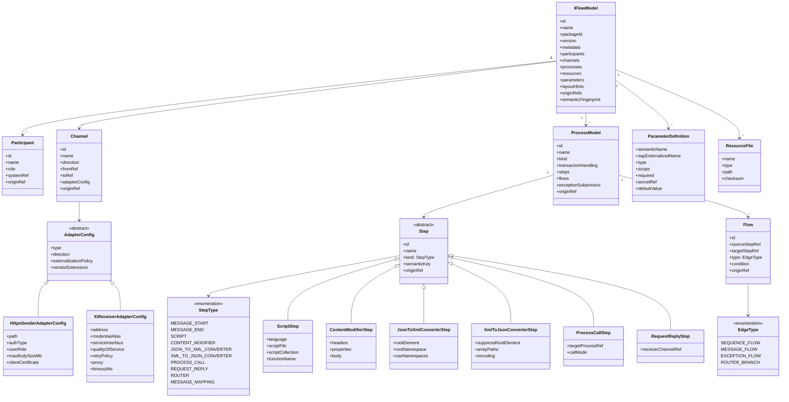
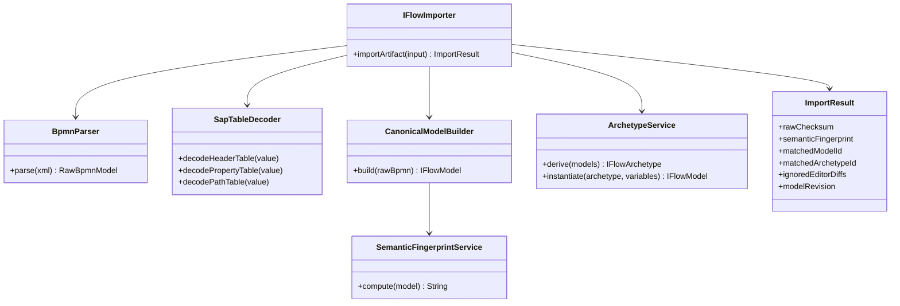
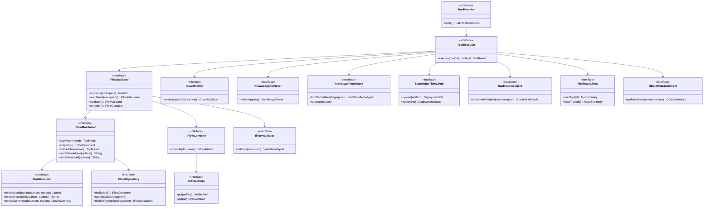
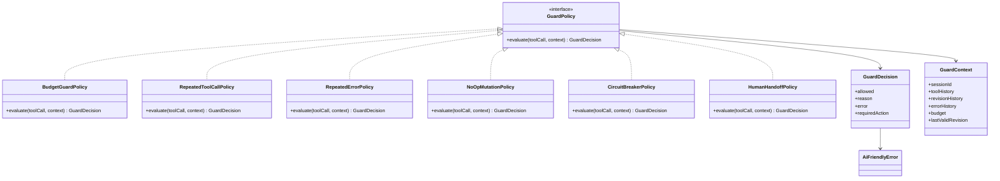

# 核心类图

## 1. 分层关系

LLM-facing 层只暴露具体 tools。后端内部可以用 `StepFactory`、`ChannelFactory` 等工厂统一创建类型化对象，但这些工厂不是 LLM tool name。

## 1.1 Backend 实现组合

```mermaid
classDiagram
    class IFlowBackend {
      <<interface>>
    }
    class IFlowMaintainer {
      <<interface>>
    }
    class IFlowCompiler {
      <<interface>>
    }
    class IFlowDocument {
      <<interface>>
    }

    class BpmnIFlowBackend
    class BpmnIFlowMaintainer
    class BpmnIFlowCompiler
    class BpmnIFlowDocument

    class TypedModelIFlowBackend
    class TypedModelIFlowMaintainer
    class TypedModelToBpmnCompiler
    class TypedIFlowDocument

    class JsonIFlowBackend
    class JsonIFlowMaintainer
    class JsonToBpmnCompiler
    class JsonIFlowDocument

    IFlowBackend <|.. BpmnIFlowBackend
    IFlowMaintainer <|.. BpmnIFlowMaintainer
    IFlowCompiler <|.. BpmnIFlowCompiler
    IFlowDocument <|.. BpmnIFlowDocument

    IFlowBackend <|.. TypedModelIFlowBackend
    IFlowMaintainer <|.. TypedModelIFlowMaintainer
    IFlowCompiler <|.. TypedModelToBpmnCompiler
    IFlowDocument <|.. TypedIFlowDocument

    IFlowBackend <|.. JsonIFlowBackend
    IFlowMaintainer <|.. JsonIFlowMaintainer
    IFlowCompiler <|.. JsonToBpmnCompiler
    IFlowDocument <|.. JsonIFlowDocument
```

## 2. 类型化 iFlow 内部模型

## 3. Factories、Repository、Validator、Compiler

```mermaid
classDiagram
    class IFlowRepository {
      +findById(id) IFlowModel
      +save(model) IFlowModel
      +saveRevision(model) IFlowModel
      +findBySemanticFingerprint(fingerprint) IFlowModel
    }

    class ModelMutationService {
      +insertChannel(model, channel)
      +insertStep(model, processRef, step, placement)
      +connectSteps(model, command)
      +addEdge(model, command)
      +updateEdge(model, command)
      +deleteEdge(model, command)
      +deleteStep(model, command)
      +updateAdapterPolicy(model, command)
    }

    class RevisionManager {
      +createRevision(model, reason)
      +rollbackTo(model, revision)
      +lastValidRevision(modelId)
    }

    class StateRenderer {
      +renderMarkdown(document, options) String
      +renderMermaid(document, options) String
      +renderCompactSummary(document) StateSummary
    }

    class ChannelFactory {
      +createSender(cmd, context) Channel
      +createReceiver(cmd, context) Channel
    }

    class StepFactory {
      <<interface>>
      +create(cmd, context) Step
    }

    class ScriptStepFactory
    class ContentModifierStepFactory
    class JsonToXmlConverterFactory
    class XmlToJsonConverterFactory
    class ProcessCallStepFactory
    class RequestReplyStepFactory

    class IFlowValidator {
      +validate(model) ValidationReport
      +validateAffected(model, semanticKey) ValidationReport
    }

    class ValidationReport {
      +status
      +issues
    }

    class ModelIssue {
      +code
      +severity
      +affectedObject
      +message
      +suggestedFixes
    }

    class TypedModelToBpmnCompiler {
      +compile(model) IFlowArtifact
    }

    class IFlowCompiler {
      <<interface>>
      +compile(document) IFlowArtifact
    }

    class BpmnElementWriter {
      +writeParticipant(participant)
      +writeChannel(channel)
      +writeProcess(process)
      +writeStep(step)
      +writeFlow(flow)
    }

    class IFlowArtifact {
      +zipPath
      +checksum
      +manifest
    }

    IFlowApplicationService --> IFlowRepository
    IFlowApplicationService --> ModelMutationService
    IFlowApplicationService --> RevisionManager
    IFlowApplicationService --> StateRenderer
    IFlowApplicationService --> ChannelFactory
    IFlowApplicationService --> StepFactory
    IFlowApplicationService --> IFlowValidator
    IFlowApplicationService --> IFlowCompiler

    StepFactory <|.. ScriptStepFactory
    StepFactory <|.. ContentModifierStepFactory
    StepFactory <|.. JsonToXmlConverterFactory
    StepFactory <|.. XmlToJsonConverterFactory
    StepFactory <|.. ProcessCallStepFactory
    StepFactory <|.. RequestReplyStepFactory

    IFlowValidator --> ValidationReport
    ValidationReport --> ModelIssue
    ModelIssue --> AiFriendlyError

    IFlowCompiler <|.. TypedModelToBpmnCompiler
    TypedModelToBpmnCompiler --> BpmnElementWriter
    TypedModelToBpmnCompiler --> IFlowArtifact
```

## 4. Import 与 Archetype 支撑类

## 5. 全局 SPI 扩展点

所有组件都必须依赖接口，不依赖具体实现。新增维护方式、编译方式、知识库、外部客户端、持久化存储或 guard policy 时，不应修改 LLM-facing tool contract。

## 6. Guardrail 策略类图

