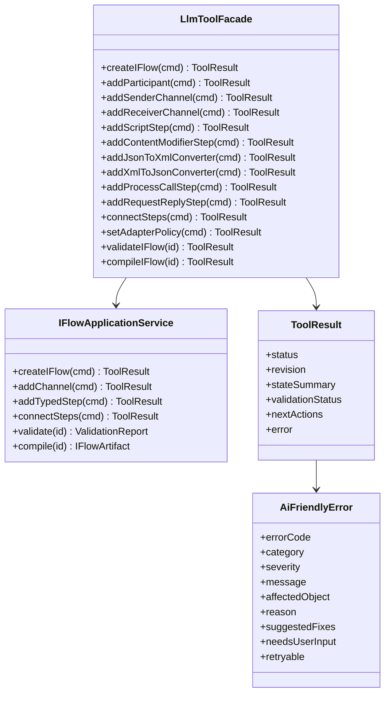
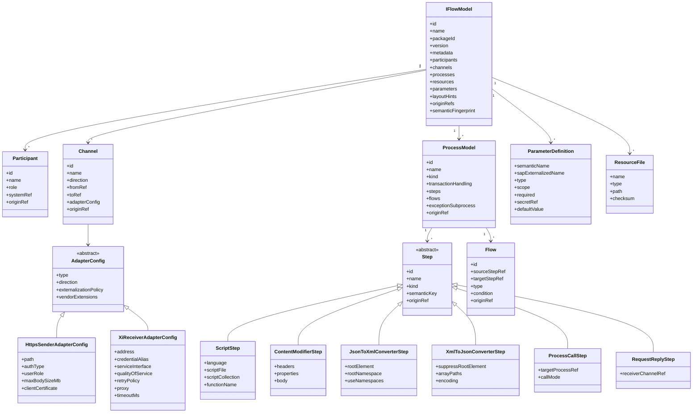
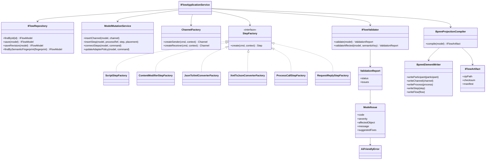
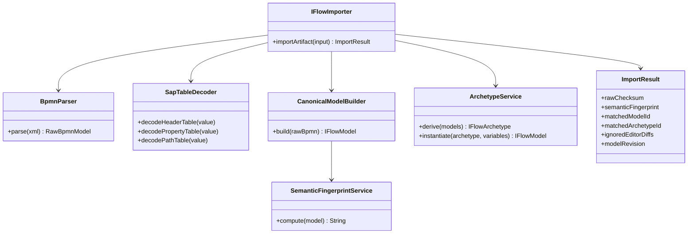

# 核心类图

## 1. 分层关系

LLM-facing 层只暴露具体 tools。后端内部可以用 `StepFactory`、`ChannelFactory` 等工厂统一创建类型化对象，但这些工厂不是 LLM tool name。

## 2. 类型化 iFlow 内部模型

## 3. Factories、Repository、Validator、Compiler

## 4. Import 与 Archetype 支撑类

